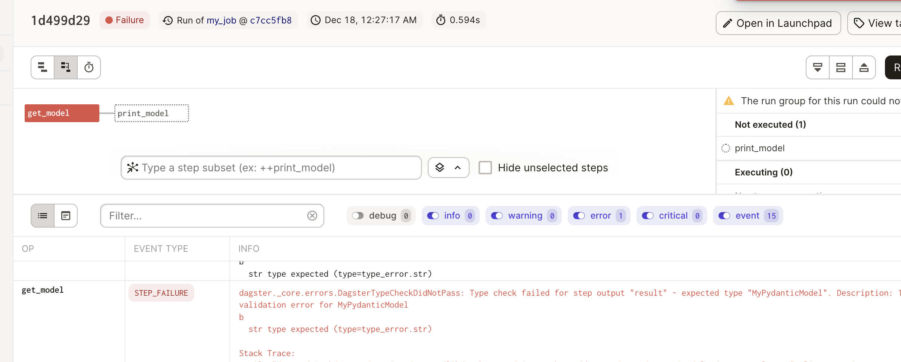

# dagster-pydantic

This is a naive approach for using Pydantic types for Dagster Type Checking. The
package `dagster_pydantic` includes a really simple validation factory. Pydanitc
is not built as a data validation library, it's actually a great parser and an
OK validator in that order.

The purpose of this validation step is to ensure the shape of the model is
correct before the data is consumed by the next op. Pydantic will stop you
during the instantiation of your model if the data is not up to spec but if you
want to check if the shape of the parsed data will match the model, that's where
the validation layer comes in.

## Usage

```python
class MyPydanticModel(BaseModel):
    """
    This is a Pydantic model.
    """
    a: int
    b: str


MyPydanticModelDT = pydantic_to_dagster_type(MyPydanticModel)

@op(out=Out(MyPydanticModelDT))
def get_model():
    model = MyPydanticModel(
        a = 1,
        b = "hello"
    )
    # This should fail type checking in the Dagit UI.
    model.b = {} # type: ignore
    return model
```

This code will result in:



Without this integration, you wouldn't see that typechecking error in the
console and the next op will consume the error.

## Developing

First, install [Just](https://github.com/casey/just)

```sh
$ just install
```

This will run two poetry commands in your current terminal, one that configures
venvs to be in the project directory so the dependencies are accessable from
your local environment. The other will install the dependencies.

```sh
$ just shell
```

This opens a current shell into your poetry virtual env.

Running tests

```sh
$ just test # This only runs pytest
```

## Disclaimer

I've only had my hands on Dagster for a few weeks. I love the declarative
framework, and the focus on flexibility + developer velocity. I am a bit iffy on
the pricing and what's offered in the "Standard plan", but otherwise I'm so
satisfied with this project this far.

That being said, I'm a noobie. This is my first integration and also my first
Python module, so feel free to drop an issue if there's something I'm missing.
